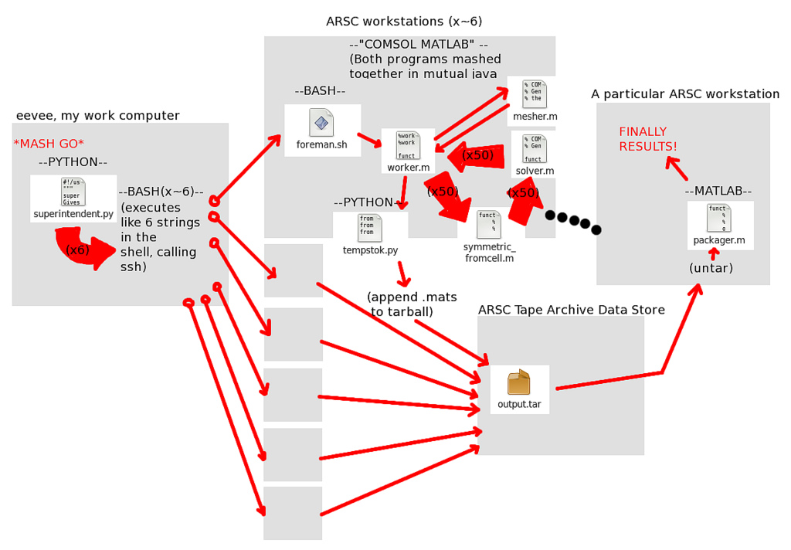

# What Didn't Work

Science tends to report in the affirmative. Most papers and documentations focus
on what *did* work, and what *was* shown as a result. However, much of science
is the "error" in "trial and error." Here, I try to document some of the ideas
that didn't work, or didn't end up being useful, and what could be learned from
them.

## Ellipsoid Measurement Space

When I first looked at this problem, I conjectured that the "shape" of the
measured conductivity space in spherical coordinates, where phi and theta
mirrored real-world orientation and radius corresponded to measured
conductivity, would have an ellipsoid shape. That is, I suspected that the
equation

    x'Kx = 1

would hold, where x is ||1/k|| long and in the measured direction, and K is the
conductivity matrix. However, this is **clearly** not the case.

This is, in part, not the case *because* the needle isn't measuring conductivity
*parallel* to the needle, but *orthogonal* to the needle, and some sort of
average of said orthogonal conductivities at that.  In retrospect, this is
obvious.

I suppose the lesson here is to make sure you fully understand the problem
before making wild conjecture.

That said, this *is* a good method for conceptualizing eigenvalues, given that
your matrix is symmetric and positive definite. It's called "Lame's Ellipsoid"
in certain contexts, and is used in discussing equivalent energy states in
certain dynamics problems and sometimes as an alternative to Mohr's Circle. In
fact, Mohr's Circle itself helps visualize eigenvalues admirably, though in
many problems outside material mechanics a shear component doesn't make sense.
I mean, "shear conductivity?" What's that?

## Parallelism

Last summer, after making the first iteration of my model, I found that 
simulations took a while to run. At about the same time, I attended the Scipy
2010 conference, and I saw a talk---I believe by David Beasley---about "DIY
concurrency." Despite Beasley's obvious bias towards python-based solutions, it
was a really good talk.

I felt inspired.

I attempted to develop a scheme that would use SSH to implement an ad-hoc 
mapreduce-esque scheme across a number of ARSC workstations to split the job of 
calulating K-values amongst about six machines.

Of course, looking at this picture, you might realize how crazy this idea was.
Parallelism isn't intractible, but trying to implement completely parallelism
with a buggy COMSOL/MATLAB interface that doesn't run headless very well and is
hard to even start from the command line, is a clunky, time-consuming
preposition. In three months of hard work, it still wasn't working.

Of course, due to licensing constraints on the part of COMSOL were only one
instance may be open at a time per person, it became a moot point.

The lesson here isn't that ad-hoc concurrency is a bad idea. The lesson here is
that one should be weary of complexity and that the importance of strong
foundations shouldn't be underestimated. People create SSH-based concurrency
schemes all the time, but they're also working with software that works just
fine and as-expected, without too many kludges, on its own. Moreover, most
concurrency uses pre-existing, stable frameworks. If one wanted to run MATLAB
programs concurrently, for example, using The Mathworks' parallel MATLAB
framework would likely be the simplest, most robust way to do it.

If anything, what this hilights is the importance of time management with
research. Given the choice between just about *anything* and avoiding spending 
more time, the correct answer is to save time:

* **Spend time to make a process faster** or **Just do the process as-is**? The latter.

* **Spend time doing something the Right Way** or **Just kludge it**? The kludge wins.

* **Spend time shopping for the best buy** or **Buy the first thing you see that'll work?** Definitely the latter. That's what grant money's for!

It's a common pattern, and while it may seem to be less than ideal, it's also
realistic.

##Direct use of MATLAB's `expint()` Function

Interestingly enough, MATLAB actually comes with an exponential integral
function, though it's defined differently in MATLAB than it is in this context.
A failed approach involved trying to fit the data points directly against the
exponential integral solution. However, the convergence properties of this
approach were less than ideal.

## Custom Data Logger

Speaking of time management: I also spent a good chunk of time researching
the programming of my own data logger using a microcontroller.  This was
because I wanted to measure angle with an accelerometer and a digital compass,
and working with the Campbell tools is a pain *even* given that all your 
instruments are analog in nature.

This isn't in and of itself a bad idea. In fact, there would be many advantages
to using a custom-programmed microcontroller over a Campbell data logger. 
However, there are other considerations:

1. I didn't know a lick about programming microcontrollers. I know a little more
now, but not enough.

2. Someone had already set up the needle probe to work with a Campbell data
logger.

3. There are less technically advanced ways to measure angle, such as
protractors.

The lesson here is to stay focused on one's project, and be ever-consious of 
what's doable given a certain time period. In this case, making a new apparatus
would be a good project for an EE's senior design project. However, for a
Mechanical Engineering graduate student that has a number of other goals, none
of which actually call for making a new measurement scheme for the needle 
probe, it's not as good of an idea.

On the other hand, having followed the "spend money" rule, I now have a MSP-430
that I don't need right now. This could lead to fun hackery down the road. Who
knows?

## Layered Glycerine

One of the "standards" used with the needle probe apparatus is to measure the
thermal conductivity of glycerine in an insulated box.  Glycerine is chosen
because its conductivity is similar to water without convecting and because it
automatically fills air gaps around the needle. So, I considered using glycerine
as a medium to build an anisotropic material, figuring its gel-like nature would
stop it from mixing.

It's true that the gel stops mixing. However, what it doesn't stop is buoyancy
effects.

Consider, for a moment, how one would change the thermal conductivity of
a fluid. Basically the only thing you can do is add something else. So, for
example, I started by trying to add rubbing alcohol because rubbing alcohol has
about a third of the conductivity of water.  On the other hand, it's also about
70% the density of water, and surely even a smaller percentage as dense as
glycerine. So, imagine trying to pour heavy vegetable glycerine over a thinned,
lightweight mixture of glycerine and rubbing alcohol. What happens, of course,
is that the alcohol mixture floats on top of the unadulterated glycerine.

This shouldn't have been a surprise, and yet it was. Interesting how that
works.  Instead, the experiments use straight table salt and table sugar.
